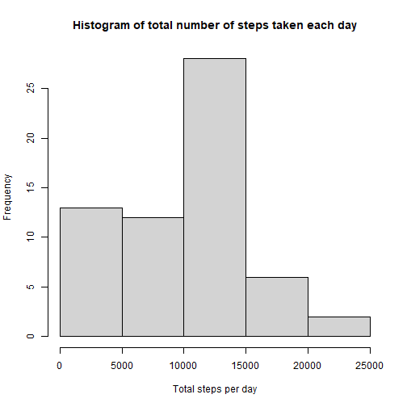
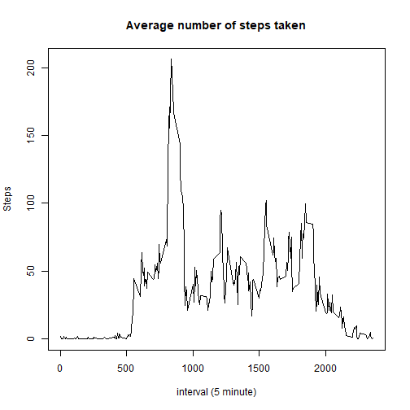
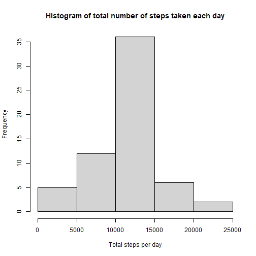
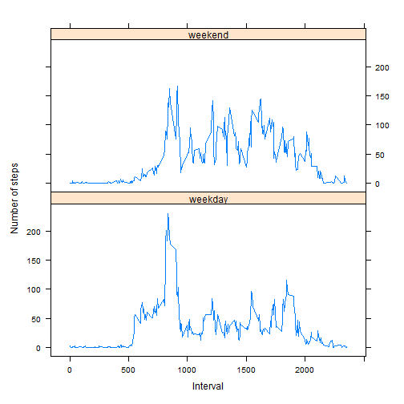

## Loading and preprocessing the data

```r
library(dplyr)
```

```
## 
## Attaching package: 'dplyr'
```

```
## The following objects are masked from 'package:stats':
## 
##     filter, lag
```

```
## The following objects are masked from 'package:base':
## 
##     intersect, setdiff, setequal, union
```

```r
v_zipfile <- "activity.zip"
v_datafile <- "activity.csv"
if (!file.exists(v_datafile)) {
        unzip(v_zipfile)
}
activity <- read.csv(v_datafile)
activity <- mutate(activity, date = as.Date(date,format="%Y-%m-%d"))
```


## What is mean total number of steps taken per day?

```r
stepsday <- summarize(group_by(activity,date), 
                      step_sum = sum(steps,na.rm=TRUE))
hist(stepsday$step_sum,xlab="Total steps per day",
     main = "Histogram of total number of steps taken each day")
```



```r
steps_mean <- mean(stepsday$step_sum)
steps_mean_p <- round(steps_mean,1)
steps_mean_p
```

```
## [1] 9354.2
```

```r
steps_median <- median(stepsday$step_sum)
steps_median_p <- round(steps_median,1)
steps_median_p
```

```
## [1] 10395
```
The mean of the total number of steps taken per day is: 9354.2

The median of the total numbre of steps taken per day is 1.0395 &times; 10<sup>4</sup>

## What is the average daily activity pattern?

```r
stepsinterval <- summarize(group_by(activity,interval), 
                      step_avg = mean(steps,na.rm=TRUE))
plot(stepsinterval$interval,stepsinterval$step_avg,type="l",
     xlab="interval (5 minute)", ylab = "Steps",
     main="Average number of steps taken")
```



```r
max_steps <- max(stepsinterval$step_avg)
stepsinterval_fil <- filter(stepsinterval,step_avg==max_steps)
max_steps_interval <- stepsinterval_fil$interval
max_steps_interval
```

```
## [1] 835
```
Which 5-minute interval, on average across all the days in the dataset,   
contains the maximum number of steps? 835  

## Imputing missing values

```r
total_missing_values <- sum(is.na(activity$steps))
```
The total number of missing values in the dataset is: 2304  


```r
new_activity <- merge(activity,stepsinterval,by="interval")
activity_filled <- mutate(new_activity, 
                          steps = case_when(
                                  is.na(steps) == TRUE ~ step_avg,
                                  TRUE ~ steps/1.0))
activity2 <- activity_filled %>% 
        select (date,interval,steps) %>% 
        arrange(date,interval)

stepsday2 <- summarize(group_by(activity2,date), 
                      step_sum = sum(steps,na.rm=TRUE))
hist(stepsday2$step_sum,xlab="Total steps per day",
     main = "Histogram of total number of steps taken each day")
```



```r
steps_mean2 <- mean(stepsday2$step_sum)
steps_mean_p2 <- round(steps_mean2,1)
steps_mean_p2
```

```
## [1] 10766.2
```

```r
steps_median2 <- median(stepsday2$step_sum)
steps_median_p2 <- round(steps_median2,1)
steps_median_p2
```

```
## [1] 10766.2
```

## Are there differences in activity patterns between weekdays and weekends?

```r
library(lubridate)
```

```
## 
## Attaching package: 'lubridate'
```

```
## The following objects are masked from 'package:base':
## 
##     date, intersect, setdiff, union
```

```r
library(lattice)
activity3 <- mutate(activity2, 
                    daytype = as.factor(case_when(
                            wday(date,week_start=1) > 5 ~ "weekend",
                            TRUE ~ "weekday"))
)

stepsday3 <- summarize(group_by(activity3,daytype,interval), 
                       steps_avg = mean(steps,na.rm=TRUE))
```

```
## `summarise()` has grouped output by 'daytype'. You can override using the `.groups` argument.
```

```r
xyplot(steps_avg  ~ interval | daytype, data= stepsday3,
       ylab = "Number of steps", xlab = "Interval",
       layout=c(1,2),type="l")
```


